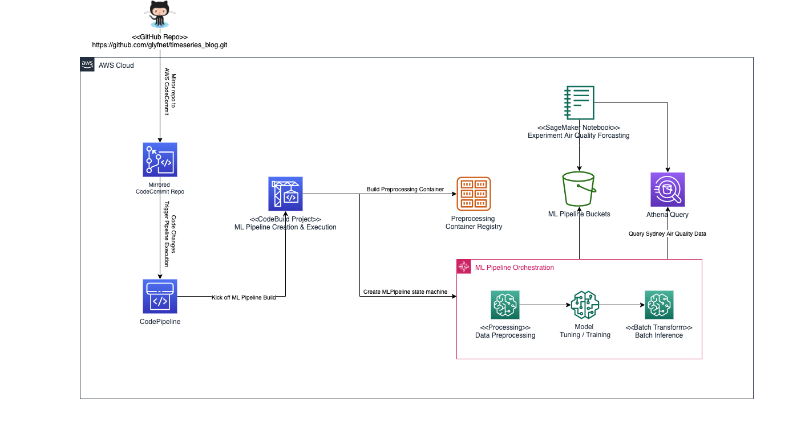
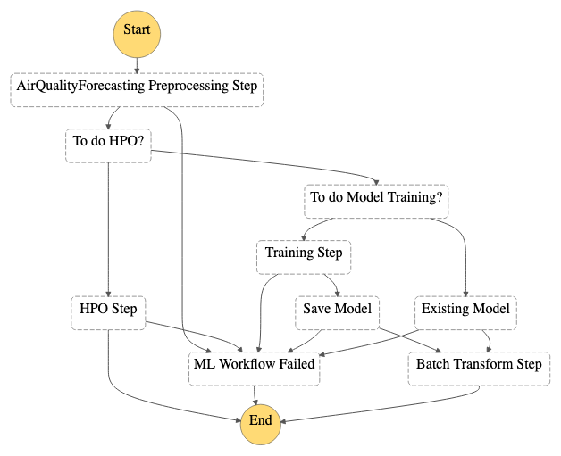

# Air Quality Forecasting Lab

The purpose of the labs is to demo how to use Amazon SageMaker built-in algorithm DeepAR to do time series data forecasting. Besides a notebook to walk through the steps, we provide ml pipeline creation reference.

## Lab Structure
There are two Jupyter Notebooks;  
1. [Forecasting Air Quality with Amazon SageMaker and DeepAR](./01_train_and_evaluate_air_quality_deepar_model.ipynb) to demo time series data forecasting.
2. [Air Quality Forecasting ML Pipeline (manual)](./02_manual_ml_pipeline_creation_for_air_quality_forecasting.ipynb) to demo ML Pipeline manual creation.

Especially, the second notebook demo how to manually create a ML Pipeline for the air quality forecasting.
 
## Pipeline Design

The pipeline design is inspired by [Amazon SageMaker Safe Deployment Pipeline](https://github.com/aws-samples/amazon-sagemaker-safe-deployment-pipeline).

### Description

* With default CFN parameter values setup during CFN stack creation, [GitHub Repo - timeseries_blog](https://github.com/glyfnet/timeseries_blog) will be mirrored to CodeCommit repo so that user can experiment code change to trigger pipeline easily.
* CodePipeline pipeline orchestrates the build process with CodeBuild project.
* CodeBuild project process `preprocess` container build and ML Pipeline creation & execution with Step Functions state machine. (***the workflow won't be part of CFN stack, hence, you may manually remove it while deleting CFN stack.***)
* State machine demo ML pipeline and orchestrate data preprocessing, model training/tuning and batch transform.
* Amazon SageMaker Notebook instance can be used to explore notebooks.

For ML Pipeline Process, Refer to

